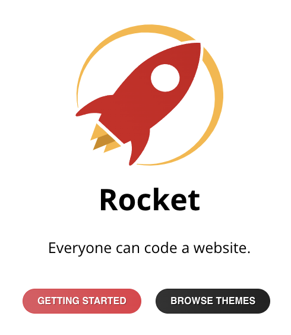

```js server

import { pete } from '../../../src/data/authors.js';

export const description =
  'Why do a bleeding edge thing when we already know that is not where the jobs are?';
export const publishDate = new Date('2022-09-23');

export const tags = ['rocket', 'javascript', 'node', 'SSG'];
export const authors = [pete];
```

# Why a Bleeding Edge Stack?

You may have noticed this site is built with extremely bleeding edge technology. In almost every way, bleeding edge tech is a dumb thing to do.

Why do I do it, if it's a bad idea?

## 8 Years Following the Google Chrome Team

In 2014 I began following the google chrome team. They were producing this new tech called Web Components. They wanted to make it a standard.

Now 8 years later, it is a standard part of the browser. Almost nobody knows about it, but many top tier shops such as google, microsoft, adobe, redhat and ING Bank have all migrated towards this new tech.

## But how seriously has the top tier migrated?

- youtube is built on Web Components
- Adobe just released their latest version of Photoshop built on Web Components. Yes, that's the app, not a web site.
- Microsoft, Redhat, Adobe, Google, and many other top tier corporations have produced their own suite of visual components on the Web Component model. Microsoft, Google, Ionic and many others created their own Web Component tooling.

Despite all of this, it is still a very small fraction of the market for new apps. React probably still has 60% of the market, with Vue and Angular taking most of the remaining. Web Components haven't even reached the red-headed-step-child level yet.

## But Wait! It is much more bleeding edge than WCs

WCs are just the beginning of the bleeding edge, here.

You know that it's going to be a bad case of "Word Salad" if all you can do is enumerate a bunch of unexplained acronyms and IT stack lingo: 

- SSG - Static Site Generator
- SSR - Server Side Rendering
- Partial hydration of dynamic components
- Smallest imagineable WC tooling library
- Built from HTML, CSS, JS/TS without complex frameworks like React
- Multi page app - not SPA

Just about the only major piece of related tech not present on this site is WASM, but that probably isn't more than 5 years away.

Each of the above would require a long explainer - and a google search would fill pages, even before sorting and sifting for what the "cool kids" are doing now with that stack.

## Common Thread? Removing things that work

If the above is confusing, this should help make it more confusing.

What is the common thread to all these stacks? They are all follow-ons to stacks that already worked perfectly. The newer stacks were created by removing the stack that worked perfectly, and replacing it with something simpler, dumber, smaller, faster.

This drives people crazy - not the least of which are the devs already skilled in the previous stacks! "I'm great at WordPress!" Sure you are, so here's an SSG that makes WordPress obsolete. Same story with React, or even a bran new and barely finished Astro or Next or Nuxt or even 11ty.

The process of replacing stacks with dumber simpler faster smaller stacks is ruthless, and it won't end here. It goes on forever.

## Or, a single metric - Lighthouse

Forget about how we got it, what's the result?

A perfect Lighthouse score. Installable as an app on your phone or desktop.

## How can I learn more?

Good question. `more to follow`


